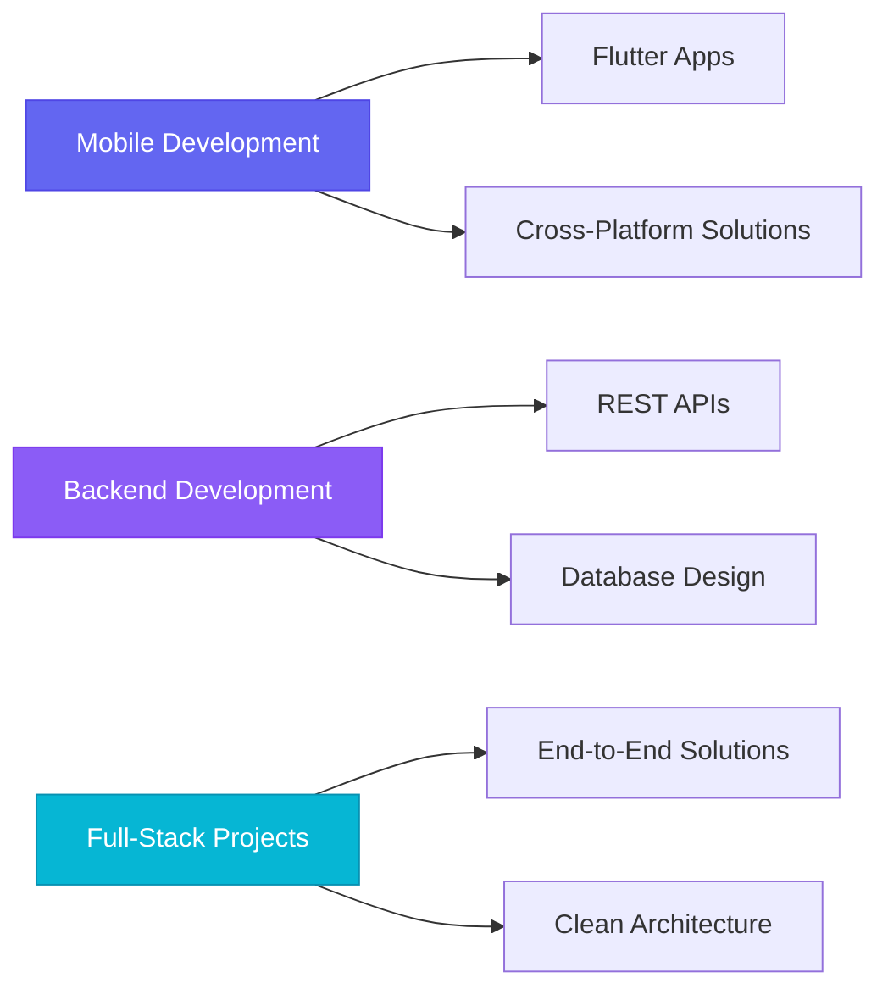

# 💫 Elgun Ismayiloff

<div align="center">

[](https://git.io/typing-svg)

</div>

<div align="center">
  
  
  
</div>

---

## 🚀 About Me

```typescript
const elgun = {
  title: "Full-Stack Developer",
  location: "🌍 Azerbaijan",
  passion: ["Clean Code", "Problem Solving", "Innovation"],
  currentFocus: "Building scalable mobile & web applications",
  technologies: {
    mobile: ["Flutter", "Kotlin", "Dart"],
    backend: ["PHP", "Python", "Java", "Laravel", "Django"],
    databases: ["MySQL", "PostgreSQL", "SQLite"],
    tools: ["Git", "VS Code", "Linux", "REST APIs"]
  },
  motto: "Code with purpose, build with passion! 🎯"
};
```

---

## 🛠️ Tech Arsenal

<div align="center">

### Languages & Frameworks


### Frameworks & Libraries


### Databases & Tools


</div>

---

## 📊 GitHub Analytics

<div align="center">
  
  
  
  
  
</div>

<div align="center">
  
  
  
</div>

---

## 🎯 Current Focus

<div align="center">



</div>

---

## 🏆 GitHub Trophies

<div align="center">
  
  
  
</div>

---

## 💼 Featured Projects

<div align="center">

| Project | Technologies | Description |
|---------|-------------|-------------|
| 🚀 **Mobile Banking App** | Flutter, Dart, REST API | Secure banking solution with biometric authentication |
| 🛍️ **E-Commerce Platform** | Laravel, PHP, MySQL | Full-featured online marketplace with admin panel |
| 📱 **Task Management** | Django, Python, PostgreSQL | Collaborative project management tool |

</div>

---

## 🌟 Professional Highlights

<div align="center">

🎯 **5+ Years** of Full-Stack Development Experience  
📱 **20+ Mobile Apps** Built with Flutter  
🌐 **50+ Web Applications** Developed  
⚡ **Clean Code** & Best Practices Advocate  
🔄 **CI/CD** & DevOps Integration Expert  

</div>

---

## 📫 Let's Connect

<div align="center">

[](https://linkedin.com/in/elgunismayiloff)
[](https://github.com/elgunismayiloff)
[](https://instagram.com/elgunismayiloff)
[](mailto:ismayiloffelgun@gmail.com)

</div>

---

<div align="center">

### 💡 "Innovation distinguishes between a leader and a follower." - Steve Jobs


**Thanks for visiting! Let's build something amazing together! 🚀**

</div>

---

<div align="center">
  
  
  
</div>
